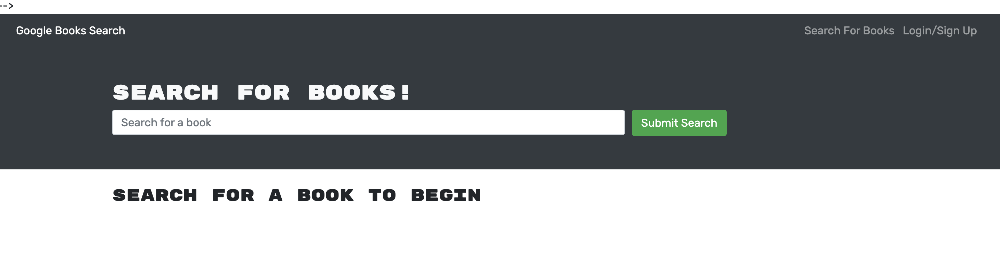

# Book-Search-Engine
Module 21: MERN Challenge

## User Story

AS AN avid reader I want to search for new books to read So that I can keep a list of books to purchase. 

# Mock-up Video

# Screenshot 

## Instructions how to run the application from the terminal
- run the command npm run develop from the terminal to initialize the application.

# Links 
- GitHub Repo : https://github.com/SwapnaMenon/Book-Search-Engine

- Heroku deployed link:

